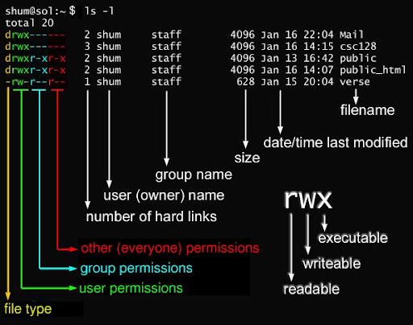

# Principais Comandos do Linux

## Pré-requisitos

Conhecimentos necessários:

* Sistemas Operacionais
* Linux

<br>

## Ver manual do bash

```bash
man bash
```

<br>

## Operações de diretório

Mostrar diretório atual:

```bash
pwd
```

Alterar diretório:

```bash
cd /home/jonathan/Downloads
```

Subir um diretório:

```bash
cd ..
```

Criar diretório:

```bash
mkdir nome-do-diretorio
```

Excluir diretório:

```bash
rmdir nome-do-diretorio
```

<br>

## Listagem de arquivos e diretórios

Listar:

```bash
ls
```

Listar incluindo ocultos:

```bash
ls -a
```

Listar em lista longa:

```bash
ls -l
```

Listar por ultima modificação:

```bash
ls -t
```

Listar por tamanho:

```bash
ls -S
```

<br>

## Trabalhando com arquivos

Criar arquivo:

```bash
cat > README.md
```

Mostrar o conteúdo do arquivo:

```bash
cat README.md
```

Juntar arquivos em um novo:

```bash
cat list1.txt list2.txt > joinlist
```

Mover arquivo:

```bash
mv Garota\ de\ Ipanema.mp3 "/home/jonathan/Music"
```

Renomear arquivo:

```bash
mv Garota\ de\ Ipanema.mp3 Girl\ from\ Ipanema.mp3
```

Excluir arquivo:

```bash
rm README.md
```

<br>

## Terminal

Limpar terminal:

```bash
clear
```

Mostrar histórico de comandos:

```bash
history
```

<br>

## Atalhos

Terminar um comando em execução:
```bash
[CTRL] + c
```

Copiar do terminal:
```bash
Ctrl + Insert #or
Ctrl + Shift + v
```

Colar no terminal:
```bash
Shift + Insert #or
Ctrl + Shift + v
```

<br>

## Sudo

Executar programas com os privilégios do superuser ou root:

```bash
sudo #use antes do comando
```

<br>

## Usuários

Adicionar novo usuário:
```bash
sudo adduser jonathan
```

Deletar uma conta:
```bash
sudo userdel -r jonathan
```

Adicionar um usuário a um grupo:
```bash
sudo usermod -a -G home jonathan
```

Remover um usuário de um grupo:
```bash
sudo deluser jonathan home
```

<br>

## Permissões

Para ver as permissões use:
```bash
ls -l
```



<br>

Para alterar permissões:
```bash
chmod 755 Repository
```


<br>

## Pacotes

### apt

Atualizar lista das versões dos pacotes disponíveis:
```bash
sudo apt-get update
```

Atualizar os pacotes instalados:
```bash
sudo apt-get upgrade
```

Instalar pacote:
```bash
sudo apt install openjdk-11-jdk
```

### .deb

Baixar o pacote .deb e depois instalar com:
```bash
sudo apt install ./<file>.deb

#se você estiver em uma versão mais antiga, execute o seguinte:
# sudo dpkg -i <file>.deb
# sudo apt-get install -f
```

### snap

Instalar usando o gerenciador de pacotes Snap:
```bash
sudo snap install code --classic
```

### 

### 

<br>

## Redirecionamento de I/O

No Linux:

* O dispositivo de entrada padrão (stdin) é o teclado
* O dispositivo de saída padrão (stdout) é a tela

Mas é possível fazer o redirecionamento de I/O.

### Redirecionamento de saída usando o simbolo > :

```bash
ls -al > list #saída em um arquivo de texto chamado list
```

Outro exemplo:

```bash
echo "Redirecionamento de I/O" > README.md #saída em um arquivo markdown
```

<br>

### Redirecionamento de entrada usando o simbolo < :

```bash
cat < list.txt #exibirá na tela o conteúdo do arquivo
```

<br>

## Pesquisa

Pesquisar em um arquivo (case sensitive):
```bash
grep linux README.md #procura a palavra linux no arquivo README.md
```

Pesquisa em um arquivo (case insensitive):
```bash
grep -i linux README.md
```

Pesquisar um arquivo:
```bash
find / -name list1.txt
```

<br>

## Pipes

Permite direcionar a saída de um comando para outro permitindo criar vários tipos de filtros:

```bash
ls | grep gnome | sort
#ls -> lista
#grep gnome -> filtra nomes de arquivos que contém gnome
#sort -> classifica em ordem crescente
```

<br>

## Compactar e Descompactar Arquivos

### gzip

Para compactar:
```bash
gzip list.txt

#para alterar o nome de saída use:
gzip -c list.txt > list.gz
```

Para descompactar:
```bash
gzip -d list.gz #or
gunzip list.gz
```

### bzip2

Para compactar:
```bash
bzip2 list.txt

#para alterar o nome de saída use:
bzip2 -c list.txt > list.bz2
```

Para descompactar:
```bash
bunzip2 list.bz2
```

### zip

Para descompactar:
```bash
unzip list.zip

#para descompactar em outra pasta use:
unzip list.zip -d /Documents/
```

### tar

Para descompactar:
```bash
#descompactar arquivo tar.bz2
tar -xjvf list.tar.bz2

#descompactar arquivo tar.xz
tar xvf list.tar.xz

#descompactar arquivo tar.gz
tar -vzxf list.tar.gz
```